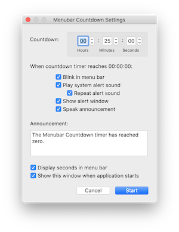

Menubar Countdown
-----------------

_Menubar Countdown_ is a simple countdown timer that displays itself on the
macOS menu bar.

To set the timer, click the menu bar icon and select the **Start...** menu item.
A dialog will appear allowing you to specify the countdown time in hours,
minutes, and seconds. The dialog also allows you to specify which of the
following forms of notification you want when the timer gets down to 00:00:00:

- Blink the icon in the menu bar.
- Play the system alert sound.
- Display an alert window.
- Display a notification in Notification Center.
- Make a spoken announcement. You can specify the text to be spoken.

Releases are available at
<https://github.com/kristopherjohnson/MenubarCountdown/releases>.

The current [2.0 version](https://github.com/kristopherjohnson/MenubarCountdown/releases/tag/2.0)
of Menubar Countdown requires macOS Mojave 10.14.4 or
newer.  It is compatible with macOS Catalina 10.15.

For macOS versions 10.6 through 10.14.3, use
[version 1.3](https://github.com/kristopherjohnson/MenubarCountdown/releases/tag/1.3).

For macOS 10.5, use version 1.2, available from
<http://s3.amazonaws.com/capablehands/downloads/MenubarCountdown-1.2.zip>

## License

Copyright 2009,2015,2019 Kristopher Johnson

Permission is hereby granted, free of charge, to any person obtaining a
copy of this software and associated documentation files (the
"Software"), to deal in the Software without restriction, including
without limitation the rights to use, copy, modify, merge, publish,
distribute, sublicense, and/or sell copies of the Software, and to
permit persons to whom the Software is furnished to do so, subject to
the following conditions:

The above copyright notice and this permission notice shall be included
in all copies or substantial portions of the Software.

THE SOFTWARE IS PROVIDED "AS IS", WITHOUT WARRANTY OF ANY KIND, EXPRESS
OR IMPLIED, INCLUDING BUT NOT LIMITED TO THE WARRANTIES OF
MERCHANTABILITY, FITNESS FOR A PARTICULAR PURPOSE AND NONINFRINGEMENT.
IN NO EVENT SHALL THE AUTHORS OR COPYRIGHT HOLDERS BE LIABLE FOR ANY
CLAIM, DAMAGES OR OTHER LIABILITY, WHETHER IN AN ACTION OF CONTRACT,
TORT OR OTHERWISE, ARISING FROM, OUT OF OR IN CONNECTION WITH THE
SOFTWARE OR THE USE OR OTHER DEALINGS IN THE SOFTWARE.

## Release Notes

v2.0 (work in progress)

- Updated for macOS 10.14.4 and newer.
- Supports dark mode.
- When timer is not active, menubar displays small hourglass icon rather than 00:00:00, to conserve menubar space.
- Added option to repeat alert sound after timer expiration, until it is acknowledged.
- Added option to blink 00:00:00 in the menu bar after timer expiration, until it is acknowledged.
- Added option to show a notification alert in Notification Center.
- Added Pause and Resume menu items.
- Translated code to Swift.

v1.3 (2019/10/21)

- Works on macOS 10.15 Catalina.
- Minimum macOS version supported is now 10.6. (10.5 is no longer supported).
- 32-bit processors are no longer supported.
- Growl is no longer supported.

v1.2 (2009/06/22)

- New application icon
- Command-X, Command-C, Command-V, and Command-A now work in the text fields in the settings dialog
- Command-R is now a shortcut key for the Restart Countdown... button in the alert window
- Add option to hide seconds in menu bar
- Show start-timer dialog when application launches
- Add Growl notifications.  The Announcement text specified in the Start dialog will be displayed in the Growl notification window.

v1.1 (2009/04/20)

- timer-expired alert window floats above other applications' windows
- added application icon
- added Doxygen comments to source code

v1.0 (2009/04/09)

- initial release

